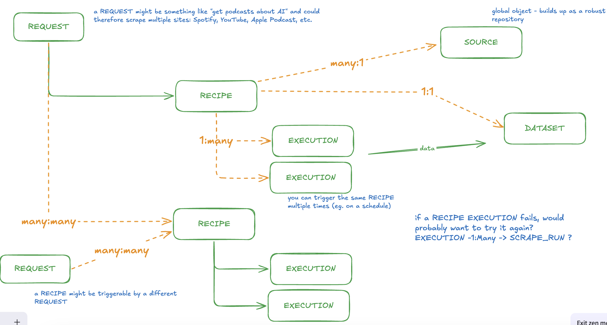

# Data Schema



Crawl techniques:

1. scrape N pages (eg. 10) of url "https://example.com", extracting the following: markdown page contents, JSON dataset with all the items from each page, and relevant fields, such as title, author, link, rating, comments
2. (future state) Batch-scrape of each item's single-page url, extracting the markdown contents, and structured JSON data of elements like the content title, description, body

We aim to store the data in a way that makes it a) interact-able via an MCP client via semantic search and b) data table renderable in a UI / extractable to CSV, etc.

## Source

A source is a global object, which will build up into a repository over time thanks to all users. A source is an agnostic representation of a dataset within a website

A single site/domain can have multiple Sources configured, representing different portions of the site, search queries, start points, etc.

Examples of sources:

- https://y.combinator.com/news, with pagination of the new posts
- https://y.combinator.com/show, with pagination of the "show" list
- https://amazon.com/s?k=mens+pages - results of pants based on a search query
- https://microns.io - recently sold list on homepage

The Source is generated through an LLM-powered recon workflow, where we dynamically analyze a site's pagination situation, and its contents, storing these agnostic aspects so that the next time someone needs it, it's already ready to go

Source Generation Workflow

1. Intakes URL
2. AI Agent:
   - Fetch page (screenshot + markdown + html)
   - Analyze pagination strategy
   - Generate navigation_schema
   - Detect typical fields/items
   - Create engine_configs for available engines
   - Store sample data
3. Save Source with status="needs_validation"
4. First Recipe execution validates Source
5. Update validation stats based on success

schema

```json
{
  "id": "source_123",
  "url": "https://amazon.com/s?k=pants",
  "url_pattern": "https://amazon.com/s",
  "domain": "amazon.com",
  "canonical_url": "https://amazon.com/s?k=pants", // Normalized version

  "engine_configs": {
    "firecrawl": {
      "actions": [
        {
          "type": "scrape",
          "params": {}
        },
        {
          "type": "click",
          "selector": "a.morelink"
        },
        {
          "type": "wait",
          "milliseconds": 1000
        },
        {
          "type": "scrape",
          "params": {}
        }
      ],
      "formats": ["markdown", "html"],
      "wait_for": "selector" | "network_idle" | null
    }
    // Future: "puppeteer": {...}, "playwright": {...}
  },

  "pagination": {
    "strategy": "next_link" | "infinite_scroll" | "spa" | "numbered_pages" | "load_more_button" | "none",
    "confidence": "high" | "medium" | "low",
    "limit_strategy": "page_count" | "item_count" | "end_condition",

    "navigation_schema": {
      "next_selector": "a.morelink",
      "href_template": "https://news.ycombinator.com/?p={page}", // null if not applicable
      "page_param": "p", // Query param for page number
      "start_page": 1,
      "item_selector": ".athing", // Selector for items on page
      "end_condition": "no_next_link" | "duplicate_items" | "empty_page"
    },

    "ai_analysis": {
      "description": "Site uses a 'More' link at bottom of page. Each page loads 30 items. Pagination continues until no more link present.",
      "pagination_type_reasoning": "Detected next link with href pattern /?p=N. No infinite scroll JS detected. Static pagination.",
      "special_notes": "Site may rate-limit after 10 pages. Consider adding delays.",
      "analyzed_at": "2025-01-01T12:00:00Z",
      "analyzer_version": "1.0.0",
      "model_used": "claude-sonnet-4"
    }
  },

  "content_structure": {
    "typical_fields": [
      {"name": "title", "type": "string", "selector": ".titleline > a"},
      {"name": "points", "type": "number", "selector": ".score"},
      {"name": "author", "type": "string", "selector": ".hnuser"},
      {"name": "comments", "type": "number", "selector": "a:contains('comments')"},
      {"name": "link", "type": "string", "selector": ".titleline > a", "attribute": "href"}
    ],
    "items_per_page": 30,
    "ai_detected": true
  },

  "validation": {
    "status": "validated" | "needs_validation" | "failed",
    "test_runs": 3,
    "success_rate": 1.0, // 0.0 to 1.0
    "last_validated": "2025-01-01T12:00:00Z",
    "issues": [] // Array of strings describing problems
  },

  "sample": {
    "screenshot_url": "s3://bucket/sources/source_123/screenshot.png",
    "markdown_excerpt": "First 500 chars of markdown...",
    "html_excerpt": "First 500 chars of HTML...",
    "sample_items": [
      {
        "title": "Example item 1",
        "link": "https://example.com/1"
      },
      {
        "title": "Example item 2",
        "link": "https://example.com/2"
      }
    ]
  },

  "usage_stats": {
    "recipe_count": 5, // How many recipes use this source
    "total_scrapes": 23,
    "last_used": "2025-01-15T10:30:00Z",
    "avg_items_per_page": 28.5
  },

  "created_at": "2025-01-01T12:00:00Z",
  "updated_at": "2025-01-15T10:30:00Z",
  "created_by": "system" | "user_456" // Track if user-contributed
}
```

Example 1: Next Link Pagination

```json
{
  "strategy": "next_link",
  "navigation_schema": {
    "next_selector": "a.next"
  },
  "engine_configs": {
    "firecrawl": {
      "actions": [
        { "type": "scrape" },
        { "type": "click", "selector": "a.next" },
        { "type": "wait", "milliseconds": 500 },
        { "type": "scrape" }
      ]
    }
  }
}
```

Example 2: Numbered Pages with URL Template

```json
{
  "strategy": "numbered_pages",
  "navigation_schema": {
    "href_template": "https://example.com/?p={page}",
    "start_page": 1
  },
  "engine_configs": {
    "firecrawl": {
      "actions": [
        { "type": "scrape", "url": "https://example.com/?p=1" },
        { "type": "scrape", "url": "https://example.com/?p=2" }
        // Generated dynamically based on Recipe limit
      ]
    }
  }
}
```

Example 3: Infinite Scroll

```json
{
  "strategy": "infinite_scroll",
  "navigation_schema": {
    "scroll_target": "window"
  },
  "engine_configs": {
    "firecrawl": {
      "actions": [
        { "type": "scrape" },
        { "type": "scroll", "direction": "down" },
        { "type": "wait", "milliseconds": 1000 },
        { "type": "scrape" }
      ]
    }
  }
}
```

## Recipe

A recipe is a user-defined scrape workflow of a given site, to go fetch the data they want to fulfill their needs.

A recipe will link to 1 Source - if a Source already exists for the scrape base_url, it will reuse it. If not, a new one will be generated.

The recipe will then contain use case-specific configuration details, such as pagination depth and target extraction fields.

The recipe will be re-usable by the user, letting them re-query the same data periodically as needed

schema

```json
{
  "id": "recipe_123",
  "user_id": "user_456",
  "name": "HN AI Product Posts",
  "description": "Track AI product launches on Hacker News", // Optional user note

  "source_id": "source_123",
  "base_url": "https://news.ycombinator.com/news",

  "extraction": {
    "limit_strategy": "page_count" | "item_count" | "date_range",

    // If page_count
    "page_count": 10,

    // If item_count
    "item_count": 1000,

    // If date_range
    "date_range": {
      "start": "2025-01-01T00:00:00Z",
      "end": "2025-01-31T23:59:59Z"
    },

    "fields": [
      {
        "name": "title",
        "type": "string",
        "required": true
      },
      {
        "name": "author",
        "type": "string",
        "required": false
      },
      {
        "name": "link",
        "type": "string",
        "required": true
      },
      {
        "name": "rating",
        "type": "number",
        "required": false,
        "default": 0
      },
      {
        "name": "comments",
        "type": "number",
        "required": false,
        "default": 0
      }
    ],

    "include_raw_content": true, // Store markdown/html with items
    "deduplicate": true, // Skip duplicate items across pages
    "deduplicate_field": "link" // Which field to use for deduplication
  },

  "execution": {
    "engine": "firecrawl", // Auto-selected from Source or user override
    "rate_limit": {
      "delay_ms": 1000, // Wait between pages
      "max_concurrent": 1
    },
    "retry": {
      "max_attempts": 3,
      "backoff_ms": 2000
    },
    "timeout_ms": 30000 // Per-page timeout
  },

  "schedule": null | {
    "enabled": true,
    "cron": "0 9 * * *", // Daily at 9am
    "timezone": "America/New_York",
    "next_run": "2025-01-16T09:00:00Z"
  },

  "datasets": {
    "active_id": "dataset_123", // Most recent successful dataset
    "total_runs": 15,
    "last_run": {
      "dataset_id": "dataset_123",
      "status": "complete",
      "started_at": "2025-01-15T09:00:00Z",
      "completed_at": "2025-01-15T09:12:34Z",
      "items_scraped": 300,
      "pages_scraped": 10,
      "errors": 0
    }
  },

  "status": "active" | "paused" | "archived",

  "created_at": "2025-01-01T12:00:00Z",
  "updated_at": "2025-01-15T09:12:34Z"
}
```

## Dataset

A dataset is the actual compiled results from a user's Recipe

The user can execute a Recipe multiple times, and the data will output to the Dataset. In the future it will enable an "append" behavior, but in the short-term it will just effectively replace it (either clearing / writing, or creating a new, or something similar)

The Dataset will need to contain some large data items

schema

```json
{
  "id": "dataset_123",
  "recipe_id": "recipe_123",
  "user_id": "user_456",
  "status": "complete" | "in_progress" | "failed" | "cancelled",

  "stats": {
    "total_items": 1000,
    "pages_scraped": 10,
    "duration_ms": 45000,
    "errors": 0,
    "last_page_scraped": 10
  },

  "schema": {
    "fields": [
      {"name": "title", "type": "string"},
      {"name": "author", "type": "string"},
      {"name": "rating", "type": "number"},
      {"name": "link", "type": "string"},
      {"name": "comments", "type": "number"}
    ]
  },

  "storage": {
    "items_table": "items", // DB table name
    "items_count": 1000,
    "size_bytes": 5242880,
    "has_embeddings": true
  },

  "created_at": "2025-01-01T12:00:00Z",
  "completed_at": "2025-01-01T12:45:00Z",
  "metadata": {
    "source_url": "https://example.com/posts",
    "scraper_version": "1.0.0"
  }
}
```

## Item

The data item composing a Dataset

schema

```json
{
  "id": "item_1",
  "dataset_id": "dataset_123",
  "page_number": 1,
  "item_index": 0,

  "extracted_data": {
    "title": "Show HN: I built a thing",
    "author": "johndoe",
    "link": "https://example.com/item/123",
    "rating": 4.5,
    "comments": 42
  },

  "raw_markdown": "# Title\n\nContent here...", // Optional
  "raw_html": "<div>...</div>", // Optional or external storage ref

  "content_embedding": [0.123, -0.456, ...], // 1536 floats, not typically exposed via API

  "scraped_at": "2025-01-01T12:12:12Z",
  "source_url": "https://example.com/item/123"
}
```

SQL table configuration

```sql
CREATE TABLE items (
  id TEXT PRIMARY KEY,
  dataset_id TEXT NOT NULL REFERENCES datasets(id),
  page_number INTEGER NOT NULL,
  item_index INTEGER NOT NULL, -- position within page

  -- Extracted structured data (flexible)
  extracted_data JSONB NOT NULL,

  -- Raw content (optional, can be large)
  raw_markdown TEXT,
  raw_html TEXT, -- Consider storing compressed or in object storage

  -- For semantic search
  content_embedding vector(1536), -- OpenAI ada-002 dimensions

  -- Metadata
  scraped_at TIMESTAMP NOT NULL,
  source_url TEXT, -- Original URL of this specific item

  -- Indexes
  CONSTRAINT unique_item_per_page UNIQUE (dataset_id, page_number, item_index)
);

CREATE INDEX idx_items_dataset ON items(dataset_id);
CREATE INDEX idx_items_embedding ON items USING ivfflat (content_embedding vector_cosine_ops);
```

Searching dataset using MCP tool: search_dataset
Returns ranked items with similarity scores. Claude can then present results to user.

```typescript
// MCP tool: search_dataset
async function searchDataset(query: string, datasetId: string, limit: number = 10) {
  // 1. Embed query
  const queryEmbedding = await embedText(query);

  // 2. Vector similarity search
  const results = await db.query(
    `
    SELECT 
      id,
      extracted_data,
      source_url,
      1 - (content_embedding <=> $1) as similarity
    FROM items
    WHERE dataset_id = $2
    ORDER BY content_embedding <=> $1
    LIMIT $3
  `,
    [queryEmbedding, datasetId, limit]
  );

  return results;
}
```
